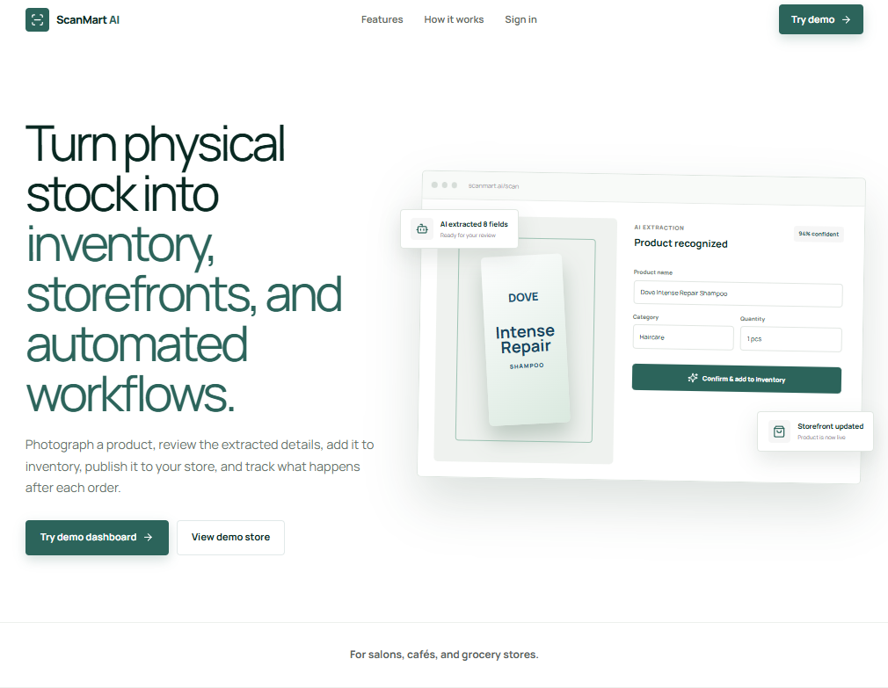
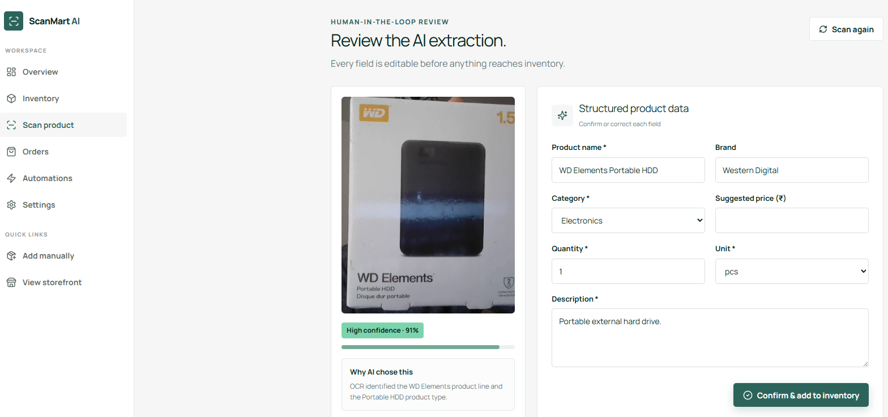
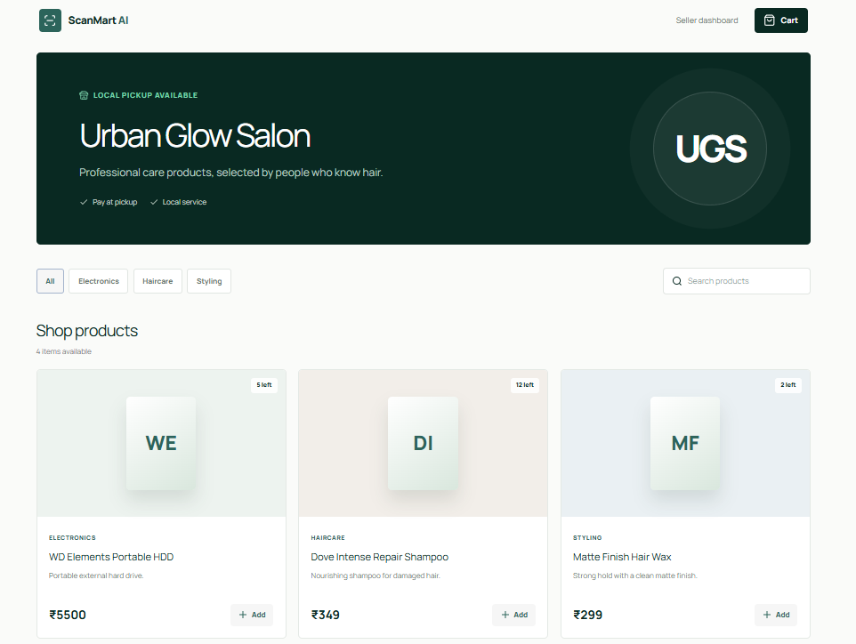
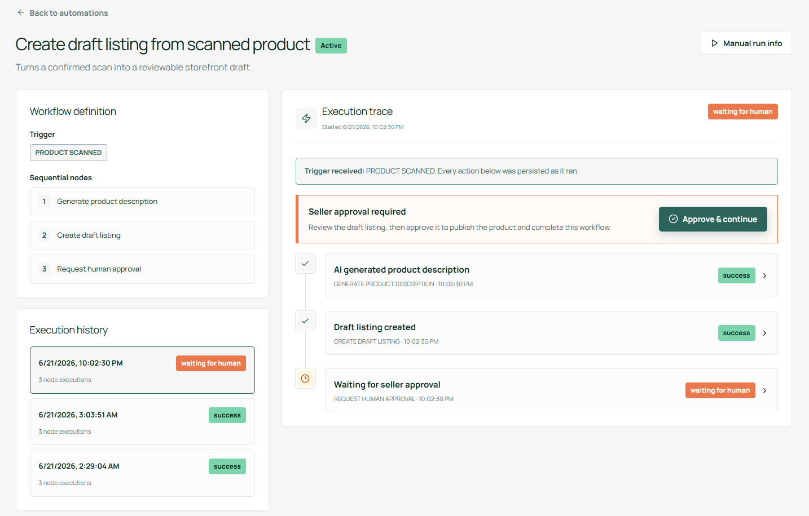
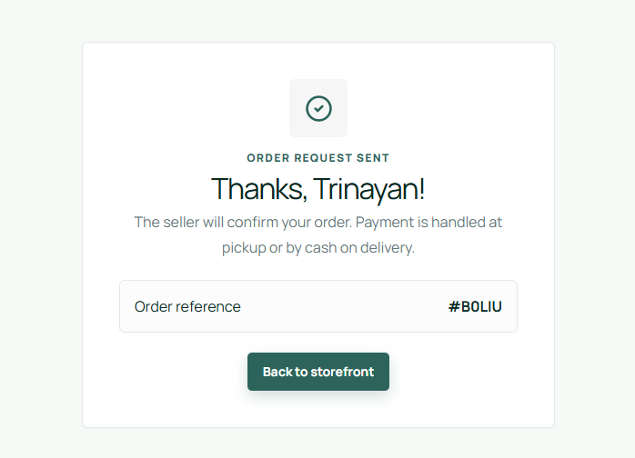

# ScanMart AI

> Turn product scans into inventory, storefront listings, and workflow automation.

AI-native commerce MVP for small businesses. Sellers scan or describe a product, review the structured output, save it to inventory, publish it to a storefront, accept customer orders, and inspect the workflow logs triggered by each action.

**AI is part of the product workflow — not a chat box added beside it.**

Live demo: _Coming soon_ · Built around **Urban Glow Salon** · No auth, no paid APIs, no setup required.

---

## Demo note

This repository contains a demo MVP, not a production store.

The included **Urban Glow Salon** workspace uses seeded sample data to demonstrate inventory, storefront publishing, order handling, low-stock states, and workflow execution traces. Some sample products may not perfectly match the salon business type because they are included to test category handling and edge cases.

The current demo runs with browser `localStorage`, OCR, and deterministic extraction. It is designed to show the complete product flow without authentication, paid AI APIs, or external setup.

## Screenshots

Screenshots use the seeded Urban Glow Salon demo workspace. The sample inventory includes mixed product categories to demonstrate edge cases such as low stock, non-salon items, draft listings, and workflow traces.

| Seller Dashboard            | Scan & Extraction Review     |
| --------------------------- | ---------------------------- |
|  |  |

| Inventory & Storefront            | Workflow Trace                 |
| --------------------------------- | ------------------------------ |
|  |  |

| Order |
| --------------------------------- | |
|  |

---

## Product Flow

```
Product scan / label text
→ OCR + structured extraction
→ seller review
→ inventory record
→ draft listing
→ storefront publishing
→ customer order
→ stock update
→ workflow trace
```

---

## Features

**Product Capture**

- Image upload, camera capture, or manual label text
- Browser-based OCR via Tesseract.js
- Structured extraction with confidence score and detected text

**Human-in-the-Loop Review**

- Every AI output is reviewed before saving
- All fields remain editable
- Seller corrections tracked as feedback

**Inventory Management**

- Quantity, price, category, and stock status
- Low-stock indicators
- Manual and AI-assisted item creation

**Storefront & Orders**

- Seller-controlled publishing to a public storefront
- Customer cart and order request flow
- Idempotent stock reduction on order acceptance

**Workflow Automation**

- Execution logs for scans, listings, orders, and low-stock checks
- Step-by-step input, output, status, and timing per action

---

## Tech Stack

| Layer        | Tools                                                              |
| ------------ | ------------------------------------------------------------------ |
| Framework    | Next.js 15, React 19, TypeScript                                   |
| Styling      | Tailwind CSS, Lucide React                                         |
| Validation   | Zod                                                                |
| OCR          | Tesseract.js                                                       |
| Demo Runtime | LocalStorage (versioned, offline-capable)                          |
| Database     | PostgreSQL / Supabase schema (production-ready, not yet connected) |

---

## Architecture

The app separates demo runtime from production persistence.

- **Demo runtime** — `AppProvider` with versioned `localStorage`. Full product flow works offline without paid services.
- **Production layer** — `supabase/` directory contains the full PostgreSQL schema, RLS policies, public storefront access rules, and seed data. Ready to connect.

---

## Project Structure

```
app/
  (dashboard)/
  store/[storeSlug]/
  cart/
  order-confirmation/[id]/

components/
  app-provider.tsx
  dashboard-shell.tsx

lib/
  ai.ts
  seed.ts
  validation.ts

types/
  index.ts

supabase/
  schema.sql
  seed.sql
```

---

## Local Setup

```bash
git clone <repository-url>
cd scanmart-ai
npm install
npm run dev
```

Open `http://localhost:3000` — no API key required for the demo.

**Quality checks:**

```bash
npm run typecheck
npm run lint
npm run build
```

---

## Roadmap

- Connect runtime to Supabase
- Seller authentication
- Product image storage via Supabase Storage
- Persist scan events and correction logs
- Real multimodal AI provider (Gemini Vision / OpenAI)
- Field-level confidence scores
- Receipt and barcode scanning
- Configurable workflow templates
- Analytics and supplier/reorder suggestions

---

## Project Boundaries

This is a portfolio MVP. It intentionally excludes production authentication, connected persistence, online payments, delivery routing, and multi-tenant billing.

The focus is one complete, observable product flow:

```
physical product → reviewed inventory → storefront listing → customer order → stock update → workflow trace
```

The demo data is intentionally not a perfect real-world salon catalog. It includes mixed products and edge cases to test how the inventory, category, stock, storefront, and workflow systems behave.
