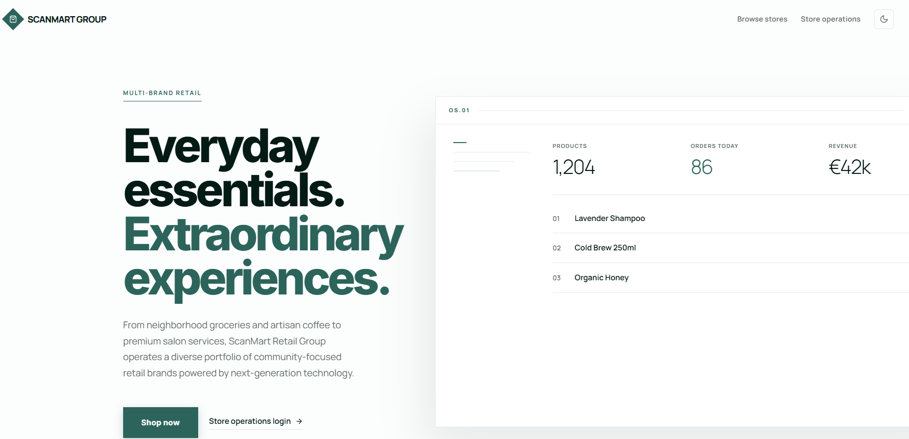
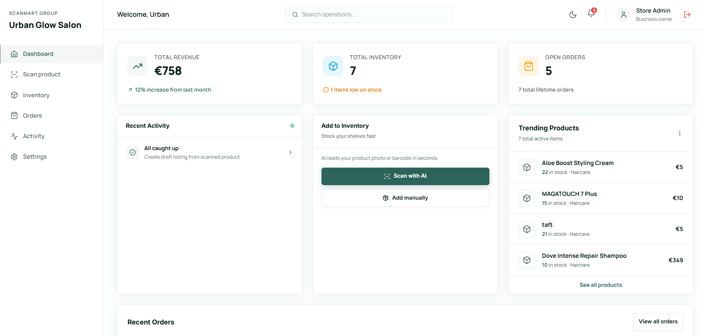
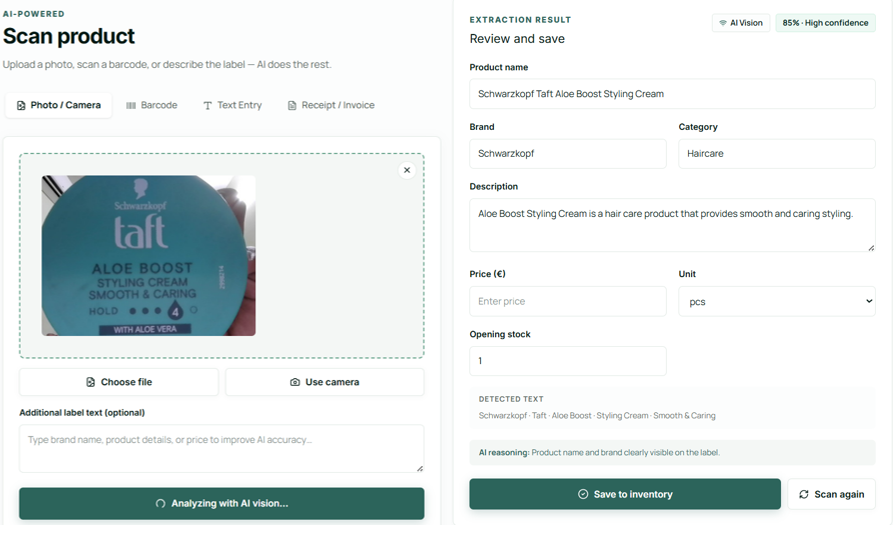
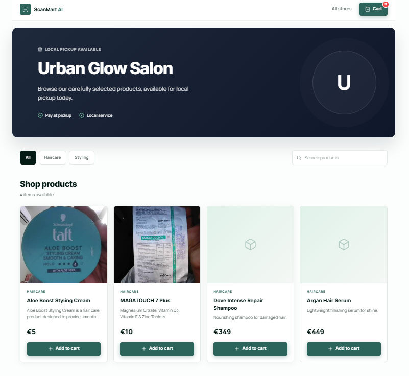
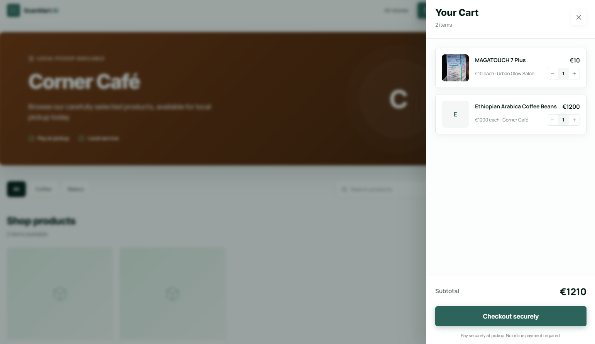
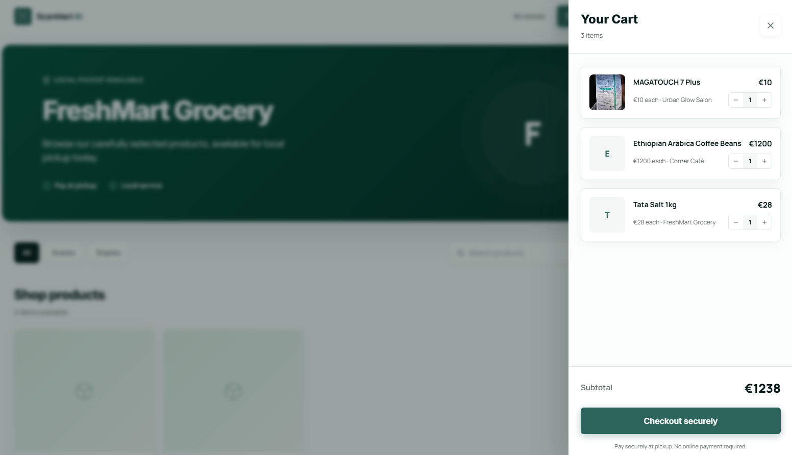
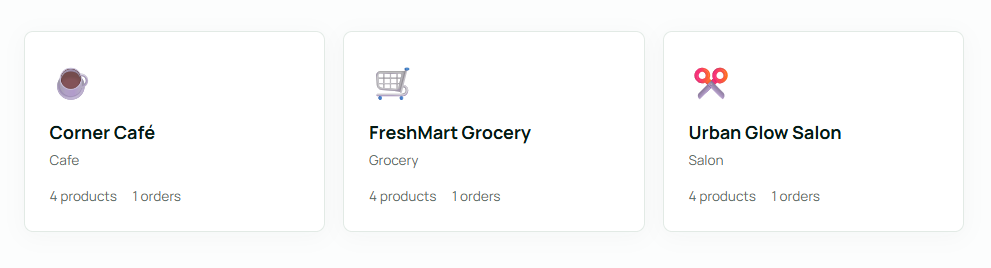
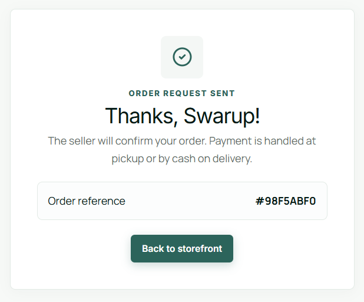

# ScanMart AI

**A multi-store retail platform where operators scan products into inventory, publish storefront listings, and manage customer orders through one shared backend.**

ScanMart AI models a retail group with multiple store formats under one company. The demo currently includes **Urban Glow Salon**, **Corner Café**, and **FreshMart Grocery**, each with its own inventory, listings, orders, and workflow traces.

The platform has two sides:

- **Admin platform** - operators manage store-specific inventory, scan products, approve listings, process orders, and inspect workflow logs.
- **Customer storefront** - shoppers browse products across stores, add items into one shared cart, and checkout once. The system splits the checkout into separate store orders internally.

AI is part of the product workflow rather than a chat box added beside it. Product scans go through extraction, confidence scoring, seller review, inventory creation, storefront publishing, and workflow logging.

The current version uses a real FastAPI backend with Supabase Postgres, NVIDIA NIM vision extraction, OCR/barcode support, atomic order processing, and a tested codebase (70 tests).

**Live demo:** https://scan-mart-ai.vercel.app

> ⚠️ **First load may take up to 50 seconds.** The backend runs on Render's free tier and sleeps after inactivity — please be patient on your first click, it will load.

---

## Screenshots

### Landing page



### Admin dashboard



### AI scan flow



### Public storefront



### Cross-store cart flow


_Browsing Corner Café and adding coffee beans. Items from any store go into one shared cart._


_The cart groups products by store while keeping one customer checkout experience._


_Three products from three stores, still inside one cart._


_Checkout creates separate store orders internally, so each store only receives its own order._

### Order confirmation



---

## What it does

Small businesses often enter the same product data across inventory, listings, and order systems. ScanMart AI reduces that manual work with a scan-to-storefront workflow.

1. **Scan** - upload a product photo, use camera input, scan a barcode, enter label text, or import a receipt/invoice.
2. **Extract** - the vision/OCR pipeline returns structured product data with confidence scoring.
3. **Review** - the operator edits or approves the extracted fields before anything is saved.
4. **Publish** - approved products can become live storefront listings.
5. **Sell** - customers browse across stores and checkout with one cart.
6. **Track** - stock changes, order actions, and AI steps are logged in workflow traces.

ScanMart Retail Group operates multiple store formats from one admin platform while keeping inventory and orders scoped per store.

---

## Tech stack

| Layer         | Choice                                             |
| ------------- | -------------------------------------------------- |
| Frontend      | Next.js 15 App Router, React 19, TypeScript strict |
| AI extraction | NVIDIA NIM - `meta/llama-3.2-11b-vision-instruct`  |
| OCR / Barcode | Tesseract.js, `@zxing/browser`, Open Food Facts    |
| Styling       | Tailwind CSS 4, CSS custom properties, dark mode   |
| Validation    | Zod                                                |
| Backend       | FastAPI + asyncpg                                  |
| Database      | Supabase Postgres                                  |
| Cart          | `localStorage` until checkout                      |
| Tests         | Vitest, 70 tests                                   |
| Eval tooling  | Python, pandas, rapidfuzz, Pillow                  |

---

## Key features

- Multi-store admin platform for a single retail group
- Store-specific inventory, listings, orders, and workflow traces
- Product capture through photo, camera, barcode, manual text, and receipt/invoice import
- Multimodal AI extraction with confidence scoring
- Human review before inventory or storefront publication
- Product photos captured from scans and shown on storefront listings
- Public storefront with cross-store shopping
- Shared customer cart across multiple stores
- Checkout splitting into separate store orders
- Atomic, idempotent order acceptance
- Server-side workflow audit trail
- Dark mode
- Test suite and extraction evaluation harness

---

## Architecture

```text
Scan / barcode / receipt
→ OCR and product extraction
→ seller review
→ FastAPI backend
→ Supabase Postgres
→ inventory record
→ draft listing
→ seller approval
→ public storefront
→ customer cart
→ checkout split by store
→ order acceptance
→ atomic stock reduction
→ workflow trace
```

Cart state stays in the browser until checkout. Inventory, listings, orders, and workflows are stored through the backend and shared across the platform.

---

## Getting started

### Frontend

```bash
git clone https://github.com/trinayanswarup/ScanMart-AI
cd ScanMart-AI
npm install
cp .env.example .env.local
npm run dev
```

### Backend

```bash
cd scanmart-backend
python -m venv .venv
source .venv/bin/activate
pip install -r requirements.txt
cp .env.example .env
python seed.py
uvicorn main:app --reload
```

On Windows PowerShell, activate the virtual environment with:

```powershell
.venv\Scripts\Activate.ps1
```

Full backend setup and Render deploy notes are in `scanmart-backend/README.md`.

**Demo access:** `admin@scanmart.eu` / `admin123`, or use the "Enter Demo Workspace" button on the login page.

---

## Python evaluation harness

The `eval/` directory measures extraction accuracy against a hand-labeled 22-image dataset of real product photos.

```bash
cd eval
pip install -r requirements.txt
python run_eval.py
python run_eval.py --preprocess
python report.py
```

Current results on raw images:

| Metric                            | Score |
| --------------------------------- | ----- |
| Overall (name + category correct) | 41%   |
| Name accuracy                     | 68%   |
| Category accuracy                 | 55%   |

Preprocessing improved category accuracy on clean images by 12 points, but did not solve blur, small text, or store-branded packaging. Those failures are model/prompt-level issues rather than image-quality issues.

The preprocessing pipeline also exists as a standalone FastAPI microservice in `scanmart-preprocess/`, built and tested but not yet wired into production.

---

## Environment variables

```env
# .env.local
NVIDIA_API_KEY=
NEXT_PUBLIC_API_URL=

# scanmart-backend/.env
DATABASE_URL=
```

---

## Roadmap

- **Done** - AI scan modes, inventory, listings, storefront, cart/checkout, workflow traces, FastAPI + Postgres backend, atomic order processing, test suite, evaluation harness
- **In progress** - real authentication and business ownership, product image storage, background workflow runner
- **Planned** - electronics and fashion store verticals, correction-based extraction improvements, operational analytics, multi-staff roles, payments

---

## Development process

Built with Claude Code as the primary development agent.

See [AGENTS-REPO.md](./AGENTS-REPO.md), [CLAUDE-REPO.md](./CLAUDE-REPO.md), and [PRD-REPO.md](./PRD-REPO.md) for the operating rules, project context, and requirements used during development.

---

## Project boundaries

ScanMart AI is a portfolio MVP, not a production retail system.

The current version is designed to demonstrate the complete product flow: product capture → reviewed extraction → inventory → storefront listing → cross-store cart → split checkout → order acceptance → workflow trace.

It does not yet include production-grade authentication, payments, delivery routing, staff permissions, or multi-tenant billing.

---

Built by [Trinayan Swarup](https://github.com/trinayanswarup)
